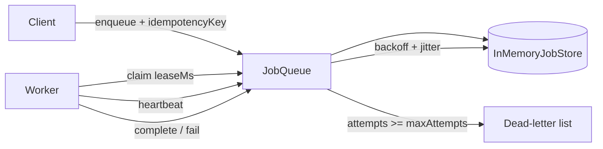

# @aadiaiagent/distributed-job-queue

**Durable-style in-process job queue** — leases, retries with exponential backoff + jitter, dead-letter queue, and idempotency keys. Zero runtime dependencies. Built as a Staff SWE portfolio piece that demonstrates distributed-systems thinking without requiring Redis, Postgres, or a cloud account.

[](https://github.com/aadiaiagent-max/distributed-job-queue/actions/workflows/ci.yml)
[](https://nodejs.org)
[](LICENSE)

---

## Why this exists

Most "toy queues" stop at `push` / `pop`. Production systems fail in messier ways:

- Workers crash mid-task → work must be **reclaimed**, not lost or double-applied blindly.
- Transient errors need **bounded retries** with **jittered backoff**, not tight loops.
- Poison messages must stop consuming capacity → **dead-letter queue (DLQ)**.
- Clients retry HTTP → enqueue must be **idempotent**.

This library encodes those invariants in a small, readable TypeScript codebase you can finish in one sitting — the same primitives you'd wire to a durable store (SQL / Redis / SQS) in a real service.

**Interview angle:** leases ≈ fencing tokens; DLQ ≈ poison-pill isolation; idempotency keys ≈ exactly-once *enqueue* (at-least-once *execution* still applies).

---

## Architecture



**Happy path:** `enqueue` → `claim` (status `leased`) → `complete` (`succeeded`).

**Failure path:** `fail` increments `attempts`. If under budget, status becomes `failed` and `availableAt` is set via `computeDelay`. If exhausted → `dead` (visible via `listDead()`).

**Crash path:** a `leased` job whose `leaseExpiresAt` is in the past is claimable again by any worker.

---

## Quickstart

```bash
git clone https://github.com/aadiaiagent-max/distributed-job-queue.git
cd distributed-job-queue
npm install
npm run typecheck
npm test
npm run example
```

### Minimal usage

```ts
import { JobQueue } from "@aadiaiagent/distributed-job-queue";

const queue = new JobQueue();

queue.enqueue(
  "send-email",
  { to: "ada@example.com" },
  { maxAttempts: 5, backoffBaseMs: 100, idempotencyKey: "email:ada:welcome" },
);

const job = queue.claim("worker-1", /* leaseMs */ 30_000);
if (job) {
  try {
    // ... do work ...
    queue.heartbeat(job.id, 30_000); // extend lease while working
    queue.complete(job.id);
  } catch (err) {
    queue.fail(job.id, err);
  }
}

console.log(queue.listDead());
```

---

## Design choices

### Leases (not infinite locks)

A claim is a **time-bounded exclusive lease**. If the worker dies, the lease expires and another worker can reclaim. This is the same idea as SQS visibility timeouts or etcd leases — crash-safe without a coordinator heartbeat fabric.

`heartbeat(id, leaseMs)` extends the lease for long-running work. Completing or failing clears the lease.

### Retries + exponential backoff with full jitter

`computeDelay(attempt, baseMs, maxMs)` uses **full jitter**: delay = Uniform(0, min(maxMs, baseMs * 2^attempt)). Full jitter dampens synchronized retry storms for fan-out workers.

### Dead-letter queue

When `attempts >= maxAttempts`, the job is marked `dead` and excluded from `claim`. Operators inspect via `listDead()`.

### Idempotency keys

`enqueue(..., { idempotencyKey })` is a **lookup-or-insert**. Safe for client retries; does **not** make handler execution exactly-once.

### In-memory store on purpose

`InMemoryJobStore` keeps the demo dependency-free and unit-testable with an injectable clock/RNG.

---

## Project layout

```
src/
  types.ts                 # Job, JobStatus, EnqueueOptions
  backoff.ts               # computeDelay (exp + full jitter)
  store/InMemoryJobStore.ts
  queue/JobQueue.ts        # enqueue, claim, complete, fail, heartbeat, listDead
  index.ts                 # public exports
tests/
examples/basic.ts
.github/workflows/ci.yml
```

---

## Roadmap

- [ ] Pluggable `JobStore` (Postgres / Redis) with compare-and-swap leases
- [ ] Concurrent claim fairness / priority lanes
- [ ] Structured metrics (claim latency, DLQ rate, lease expiries)
- [ ] Optional worker loop helper with graceful shutdown
- [ ] Replay API for dead-letter jobs

---

## License

MIT © 2026 [aadiaiagent-max](https://github.com/aadiaiagent-max)
